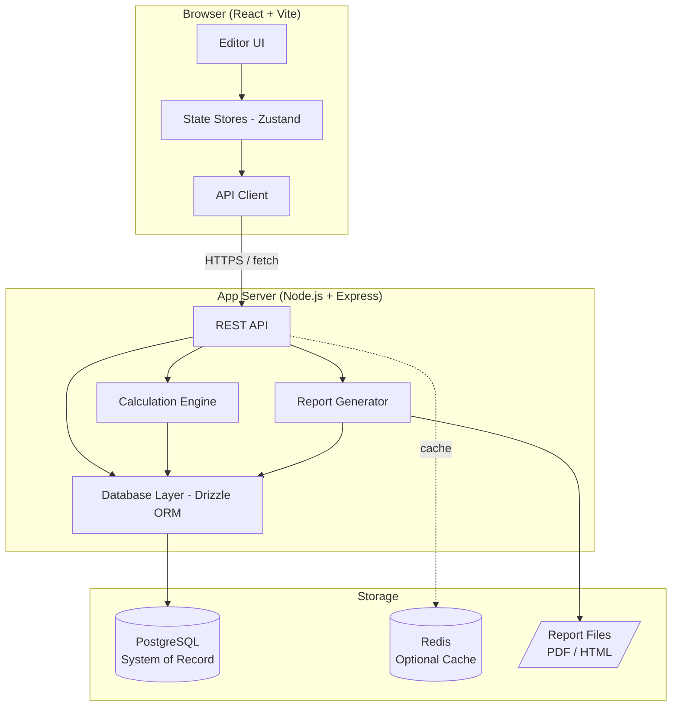
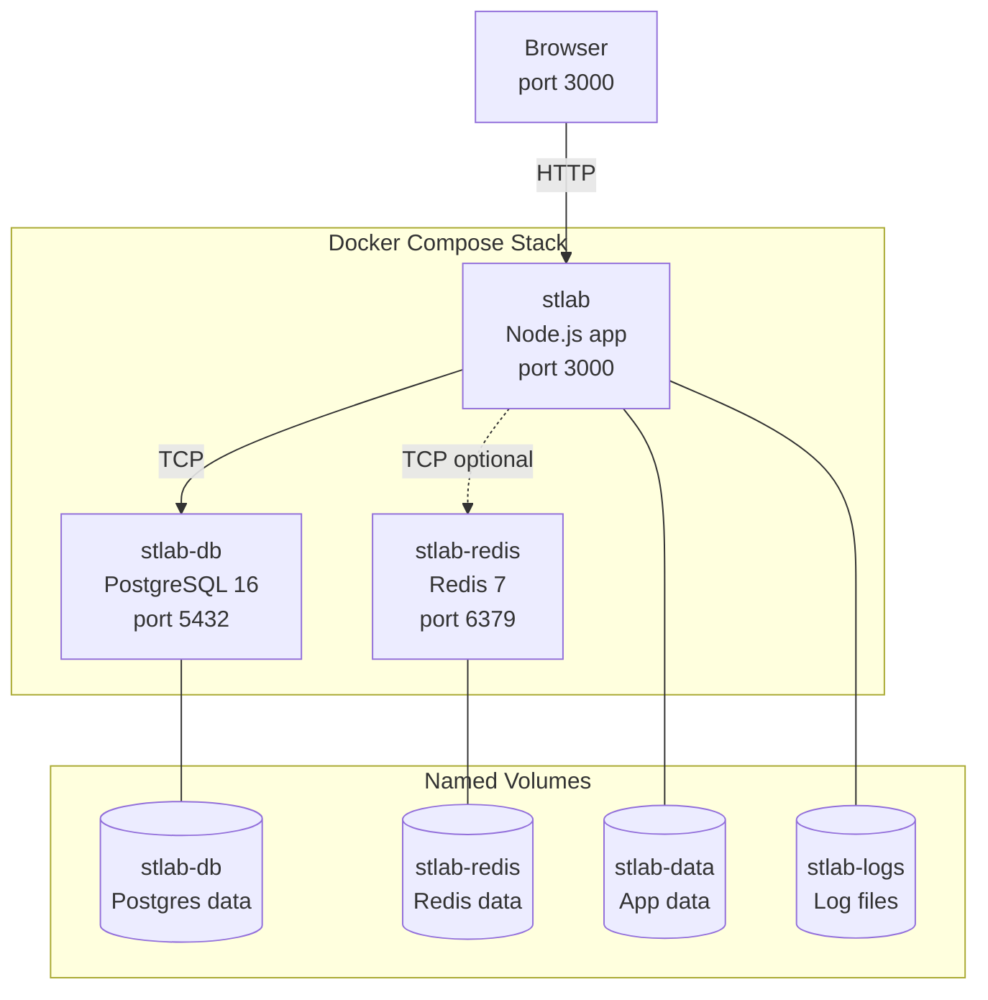
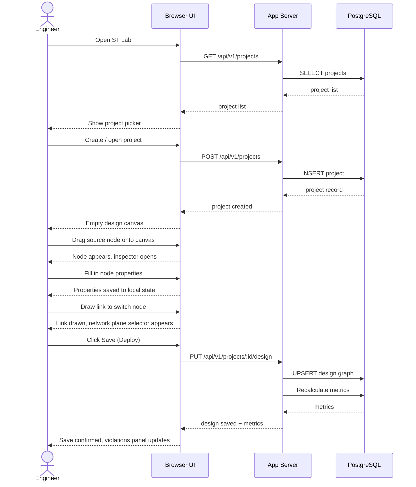
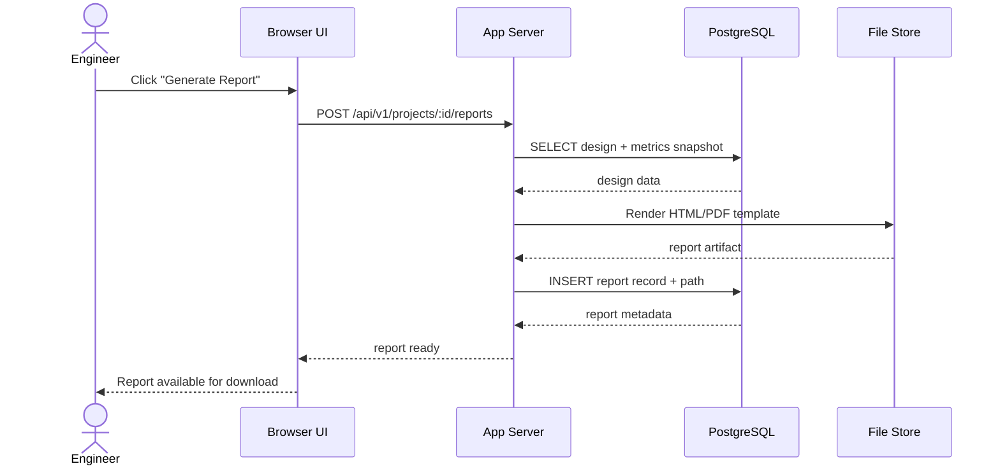
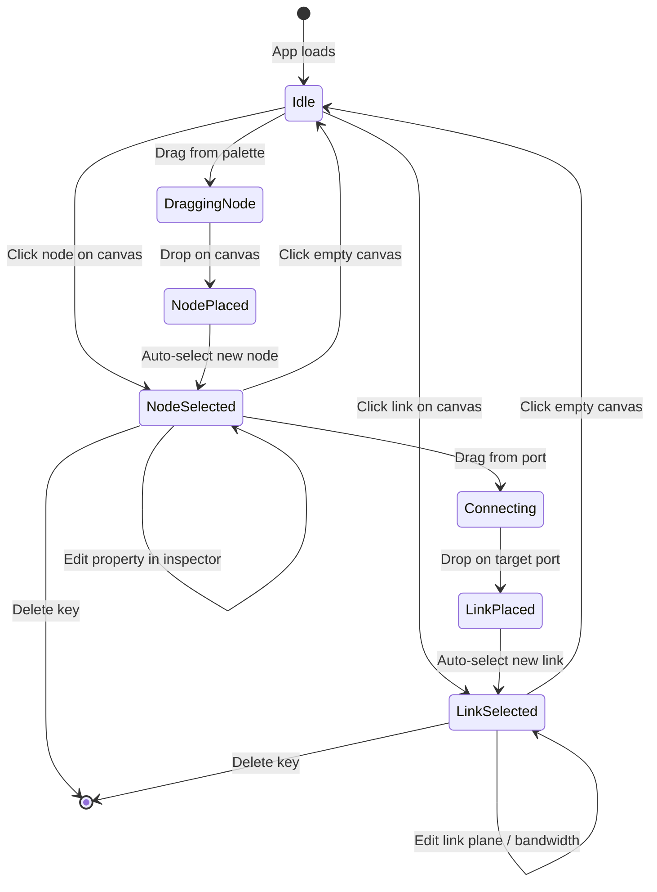
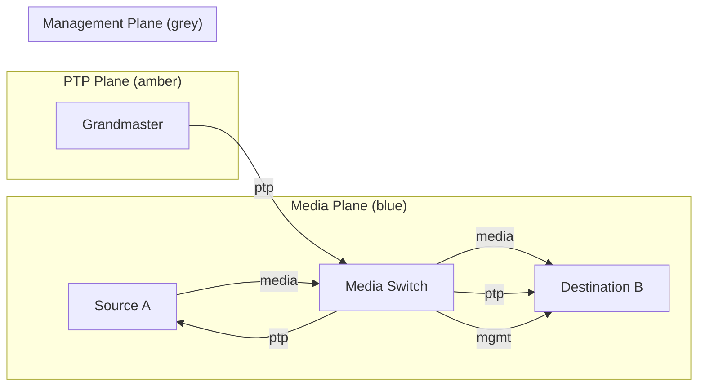
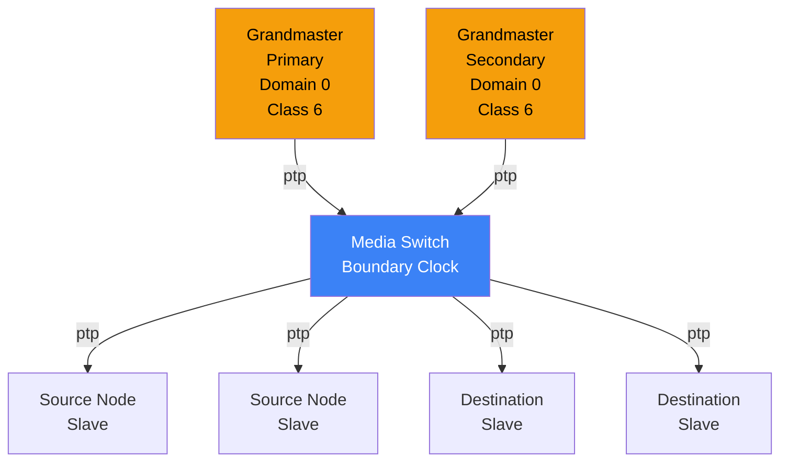

# ST Lab — Project Brief

**Version:** 2.0 — Full Reset  
**Status:** Active  
**Repository:** [github.com/Capp3/STLab](https://github.com/Capp3/STLab)  
**License:** GNU General Public License v3.0  
**Runtime baseline:** Node.js ≥ 22  
**Standards context:** [SMPTE ST 2110](https://www.smpte.org/) — Professional Media over IP

---

## Contents

1. [Executive Summary](#1-executive-summary)
2. [Problem Statement](#2-problem-statement)
3. [Goals and Non-Goals](#3-goals-and-non-goals)
4. [Development Philosophy and Pace](#4-development-philosophy-and-pace)
5. [Node-RED as UX and Architecture Reference](#5-node-red-as-ux-and-architecture-reference)
6. [System Architecture](#6-system-architecture)
7. [User Flows](#7-user-flows)
8. [Data Platform and Persistence](#8-data-platform-and-persistence)
9. [Node Types and Schemas](#9-node-types-and-schemas)
10. [Network Plane Model](#10-network-plane-model)
11. [PTP Engineering](#11-ptp-engineering)
12. [Reporting](#12-reporting)
13. [Technology Stack](#13-technology-stack)
14. [Delivery Phases](#14-delivery-phases)
15. [Operator Testing Protocol](#15-operator-testing-protocol)
16. [Open Decisions](#16-open-decisions)
17. [Glossary](#17-glossary)
18. [Related Documents](#18-related-documents)

---

## 1. Executive Summary

ST Lab is a **browser-hosted engineering application** for planning and documenting SMPTE ST 2110 IP media systems before deployment. Engineers build **visual system diagrams** — nodes connected by typed links — that carry **structured engineering data**: essence flows, switch and link capacity, timing (PTP) considerations, and NMOS-oriented control-plane context.

**First-class outputs are reports** suitable for design review and implementation handoff. The interaction model is intentionally aligned with **[Node-RED](https://nodered.org/)** — flow-style editor, typed node palette, connectable graph, inspectable properties sidebar.

**PostgreSQL** is the system of record. Designs, revisions, metrics, and generated reports remain queryable, auditable, and versioned. **Redis** is an optional supporting layer for caching and job coordination.

**Simulation and live orchestration are out of scope for Phase 1** but the architecture must not preclude them.

---

## 2. Problem Statement

IP convergence places audio, video, timing, control, and management on shared or closely related network infrastructure. **Path tracing, capacity reasoning, and documentation** are significantly harder than in discrete SDI-era designs.

ST Lab reduces that friction by:

- Representing **equipment, essences, and network paths** in one coherent, persistent model.
- Surfacing **bandwidth and utilisation** at links and switches, with violation detection.
- Supporting **multiple network planes** (media, PTP, NMOS/control, management) without collapsing unrelated traffic into a misleading single wire.
- Producing **engineering reports** grounded in the same model as the diagram — not from a separate documentation step.
- Providing a **planning tool**, not a monitoring tool, with design-time assumptions that can later be replaced by measured or simulated values.

---

## 3. Goals and Non-Goals

### 3.1 Goals

| Area | Goal |
|---|---|
| **Audience** | Engineers designing or reviewing ST 2110 facilities and IP media networks. |
| **Workflow** | Engineering-first: model → validate → document. |
| **Language** | SMPTE-oriented, essence-centric terminology throughout UI and reports. |
| **Visualisation** | Simple, readable graph with rich underlying data — metadata and calculations, not decorative lines. |
| **Topology** | Support simple and complex layouts from day one, including segmented and discrete fabrics. |
| **Timing** | PTP-aware design calculations from Phase 1; timing architecture evaluable during planning. |
| **Reporting** | Reports are a first-class deliverable, backed by persisted structured data in PostgreSQL. |
| **Future fit** | Architecture supports other IP media ecosystems (NDI, Dante) without breaking ST 2110 as the primary model. |
| **Pace** | Slow, deliberate, operator-tested iteration — every increment is validated by a real user before the next begins. |

### 3.2 Non-Goals (Phase 1)

- Replacement for production NMS or fleet monitoring tools.
- Live facility controller or orchestrator.
- Full real-time simulator (simulation is Phase 2; the data model must not block it).
- Single fixed topology style only.
- Multi-user concurrent editing in Phase 1.

---

## 4. Development Philosophy and Pace

### 4.1 Slow and Deliberate Iteration

This project is built at a **deliberately slow, iterative pace**. This is not a weakness — it is a design decision. Every feature increment must be:

1. **Specified clearly** in this brief or a linked task document before work begins.
2. **Built as the smallest useful unit** — no speculative features, no "while I'm here" additions.
3. **Operator-tested by a real user** (not just a developer) before the next increment begins.
4. **Documented** in the memory bank before moving on.

### 4.2 Operator Testing Protocol

Each feature increment follows this gate before proceeding:

```
Build increment → Deploy locally via Docker Compose → Operator performs defined test steps
→ Operator confirms pass/fail → Document outcome → Decide next increment
```

**No increment is considered complete until the operator signs off.** A developer confirming their own code works does not constitute operator testing.

### 4.3 What "Operator Testing" Means

- The operator is a **broadcast/IP media engineer**, not a software developer.
- Tests are **task-oriented**: "Create a project, add a source node, connect it to a switch, save, reload — does the design persist correctly?"
- Failure modes the operator discovers are **more valuable than tests that pass** — they represent real-world friction in the engineering workflow.
- Test steps are written in the task document **before** building, not after.

### 4.4 Branch and Commit Discipline

- Every feature increment lives on its own branch.
- No feature merges to `main` without passing operator testing.
- Commit messages describe **why**, not just what.
- The memory bank (`memory-bank/tasks.md`) is the running task log.

### 4.5 Rule: Do Not Over-Build

The previous implementation attempt accumulated complexity faster than it could be validated. The result was a broken system. This reset exists because **building too fast is more expensive than building too slow**.

> *"If in doubt, do less."*

---

## 5. Node-RED as UX and Architecture Reference

### 5.1 Node-RED as the Mental Model

The product owner intends ST Lab's interaction model to **follow Node-RED closely**. The development team must treat Node-RED as the **primary UX reference** — not the codebase, but the **interaction patterns, conceptual model, and visual grammar**.

[Node-RED](https://nodered.org/) is a flow-based visual programming tool built on Node.js. It is not a broadcast tool, but its editor pattern maps cleanly onto ST 2110 system design.

### 5.2 Concept Mapping

| Node-RED Concept | ST Lab Equivalent | Notes |
|---|---|---|
| **Flow document** | Design document | Versioned graph + domain payloads + layout hints. Stored in PostgreSQL. |
| **Editor workspace** | ST 2110 design canvas | Node palette left, canvas centre, inspector/panels right. |
| **Node** | Equipment / role node | Typed, with domain-specific schema (see §9). |
| **Wire** | Link | Selectable, typed by network plane, multi-flow capable. |
| **Node palette** | Equipment palette | Categories: Sources, Destinations, Switches, Timing, Control. |
| **Info/debug sidebar** | Engineering panels | Bandwidth trace, PTP summary, violations, report preview. |
| **Deploy button** | Save / validate | Persists design to PostgreSQL, triggers metric recalculation. |
| **Subflow** | Group node | (Phase 2) Collapsed sub-design for complex equipment. |
| **Context** | Design-level metadata | Project name, environment, revision, audit fields. |

### 5.3 Node-RED Editor Layout (Reference)

```
┌─────────────────────────────────────────────────────────────────┐
│  Toolbar: Project name ·  Save  ·  Metrics  ·  Reports          │
├──────────┬──────────────────────────────────────┬───────────────┤
│          │                                      │               │
│  Node    │         Design Canvas                │  Inspector /  │
│  Palette │    (nodes and typed links)           │  Panels       │
│          │                                      │               │
│  Sources │                                      │  - Properties │
│  Dest.   │                                      │  - Bandwidth  │
│  Switches│                                      │  - PTP        │
│  Timing  │                                      │  - Violations │
│  Control │                                      │  - Reports    │
│          │                                      │               │
└──────────┴──────────────────────────────────────┴───────────────┘
```

### 5.4 Key Node-RED Behaviours to Replicate

1. **Drag from palette onto canvas** to create a node.
2. **Click a node** to open its property inspector in the right panel.
3. **Draw a wire** by dragging from a node's output port to another node's input port.
4. **Click a wire** to select it and inspect its properties.
5. **Double-click canvas** to open a node search/add dialog.
6. **Keyboard shortcuts**: Delete to remove selected, Ctrl+Z to undo, Ctrl+S to save.
7. **Visual feedback**: unsaved changes indicated in the toolbar.
8. **Validation feedback**: violations shown as badges on nodes/links and in the violations panel.

### 5.5 Where ST Lab Diverges from Node-RED

- ST Lab links are **typed by network plane** — a single physical cable may have separate media/PTP/management plane links in the model.
- ST Lab nodes carry **SMPTE-specific domain data** (bandwidth calculations, essence counts, PTP roles) not present in generic Node-RED.
- ST Lab's primary output is an **engineering report**, not a running program.
- **No execution runtime** in Phase 1 — ST Lab models intent, not live state.

---

## 6. System Architecture

### 6.1 High-Level Architecture



### 6.2 Application Layers

```mermaid
graph LR
    subgraph Client ["Client Layer"]
        Canvas[Flow Canvas\nReact Flow]
        Palette[Node Palette]
        Inspector[Inspector Panel]
        Reports_UI[Reports Panel]
    end

    subgraph State ["State Layer"]
        DesignStore[designStore\nZustand]
        ProjectStore[projectStore\nZustand]
        UIStore[uiStore\nZustand]
        MetricsStore[metricsStore\nZustand]
    end

    subgraph API ["API Layer"]
        Projects[/projects]
        Designs[/designs]
        Metrics[/metrics]
        Reports[/reports]
    end

    Canvas --> DesignStore
    Palette --> DesignStore
    Inspector --> DesignStore
    Inspector --> UIStore
    Reports_UI --> MetricsStore

    DesignStore --> Designs
    ProjectStore --> Projects
    MetricsStore --> Metrics
```

### 6.3 Docker Compose Topology



---

## 7. User Flows

### 7.1 Primary Flow: Design and Save



### 7.2 Report Generation Flow



### 7.3 Node Interaction Flow



---

## 8. Data Platform and Persistence

### 8.1 PostgreSQL — System of Record

All durable state lives in PostgreSQL with ACID transactions and schema migrations via Drizzle ORM.

| Domain | Persisted entities |
|---|---|
| **Projects** | Project metadata, environment tags, audit timestamps. |
| **Design revisions** | Immutable graph snapshots, schema version, editor layout hints. |
| **Derived metrics** | Precomputed bandwidth rollups per link/switch/node; invalidated on design save. |
| **Reports** | Report definitions, generated artifact paths, parameters used, generation timestamps. |
| **Research linkage** (optional) | Tie-out to `research/` outputs for "why this default" in calculators. |

### 8.2 Redis — Optional Supporting Layer

Redis sits **beside** PostgreSQL, never replacing it as the authority.

| Use case | Notes |
|---|---|
| Derived metrics cache | Hot rollups with TTL or explicit invalidation on design save. |
| Session / rate limiting | If API uses server-side sessions. |
| Job coordination | Locks or deduplication keys for report generation jobs. |
| Real-time collaboration (Phase 3+) | Pub/sub for presence; durable state always commits to PostgreSQL first. |

The application must **degrade gracefully** if Redis is unavailable.

### 8.3 Schema Design Principles

- Use **JSONB** for graph payloads and extensible node properties.
- Use **normalised tables** for entities that are queried, joined, or constrained (projects, report metadata, user records).
- Store **large binary report artifacts** as file paths in PostgreSQL with the blobs on disk; for larger deployments, the pointer pattern extends to S3-compatible object storage.
- Apply **schema migrations** via Drizzle ORM — never alter schema manually in production.

---

## 9. Node Types and Schemas

### 9.1 Node Type Palette

| Type | Category | Intent |
|---|---|---|
| Single Source | Sources | One ST 2110 essence source endpoint. |
| Group Source | Sources | Bundle of related essences/flows (multi-channel audio, multi-flow video). |
| Single Destination | Destinations | Single receive endpoint / flow consumer. |
| Group Destination | Destinations | Multi-flow sink with flow mapping rules. |
| Dedicated Switch | Switches | Switch reserved for a domain; capacity reservation is the primary concern. |
| Shared Switch | Switches | Shared fabric with explicit contention and non-ST 2110 load modelling. |
| Grandmaster Clock | Timing | PTP grandmaster reference node. |
| NMOS Device | Control | Control-plane device metadata and associations. |

### 9.2 Single Source — Properties

| Field | Type | Notes |
|---|---|---|
| Name, ID | string | Human label; stable unique identifier. |
| Device Type | enum | Equipment classification. |
| Signal type | enum | Audio / video / combined. |
| Bandwidth | number | User-defined or calculated (Mbps). |
| Resolution | string | Video context (e.g. 1920×1080). |
| Video refresh rate | number | Hz. |
| Video bit depth | number | Bits. |
| Audio bit depth | number | Bits. |
| Audio sample rate | number | Hz. |
| Connection type | enum | Fibre / copper; 10G / 25G / 100G. |
| IP, MAC | string | Optional. |

### 9.3 Group Source — Properties

| Field | Type | Notes |
|---|---|---|
| Name, ID | string | |
| Device Type | enum | |
| Signal type | enum | |
| Number of essences/flows | number | |
| Aggregate bandwidth | number | Defined or calculated (Mbps). |
| Member flow definitions | array | Structured sub-model. |
| Connection type | enum | |
| IP range / multicast group, MAC | string | Optional. |

### 9.4 Single Destination — Properties

| Field | Type | Notes |
|---|---|---|
| Name, ID | string | |
| Device Type | enum | |
| Accepted signal type | enum | |
| Required bandwidth | number | Mbps. |
| Resolution support | string | |
| Video refresh rate support | number | |
| Video / audio bit depth support | number | |
| Connection type | enum | |
| IP, MAC | string | Optional. |

### 9.5 Group Destination — Properties

Mirrors Group Source with receive semantics (accepted signal types, required bandwidth, flow mapping rules).

### 9.6 Dedicated Switch — Properties

| Field | Type | Notes |
|---|---|---|
| Name, ID | string | |
| Switch role | enum | Dedicated. |
| Port count | number | |
| Port speeds | enum | 10G / 25G / 100G per port. |
| Connected device count | number | Derived or input with validation. |
| Flow / essence counts | number | |
| Backplane capacity | number | Gbps. |
| Reserved bandwidth budget | number | Gbps. |
| PTP mode | enum | None / Boundary Clock / Transparent Clock. |
| Multicast support | boolean | |
| Management IP | string | Optional. |

### 9.7 Shared Switch — Properties

All Dedicated Switch fields plus:

| Field | Type | Notes |
|---|---|---|
| Existing non-ST 2110 load | number | Gbps — contention-aware planning. |
| QoS / priority profile | string | |
| Available bandwidth budget | number | Gbps after non-ST 2110 load is subtracted. |

### 9.8 Grandmaster Clock — Properties

| Field | Type | Notes |
|---|---|---|
| Name, ID | string | |
| Clock class | number | IEEE 1588 clock class. |
| Clock accuracy | enum | |
| Priority 1, Priority 2 | number | |
| Domain number | number | |
| Announce interval | number | Log base 2 seconds. |
| Sync interval | number | Log base 2 seconds. |
| Delay mechanism | enum | E2E / P2P. |
| Redundancy role | enum | Primary / secondary. |
| Management IP | string | Optional. |

### 9.9 NMOS Device — Properties

| Field | Type | Notes |
|---|---|---|
| Name, ID | string | |
| Device role | enum | Controller / Node / Registry. |
| Supported NMOS specs | array | IS-04, IS-05, IS-08, etc. |
| API endpoint | string | |
| Node / device identifier | string | UUID per NMOS spec. |
| Registration mode | enum | Registered / peer-to-peer. |
| Authorization mode | enum | None / OAuth2. |
| Associated media flows | array | References into media plane model. |
| Management IP | string | Optional. |

### 9.10 Bandwidth Tracing — Time-Aware Datapoints

| Field | Notes |
|---|---|
| Timestamp / snapshot time | Design-time or future measurement/simulation. |
| Measured bandwidth | Placeholder at design time. |
| Peak bandwidth | Windowed. |
| Reserved / available bandwidth | |
| Ingress / egress split | |
| Total / active flow count | |
| Essence type breakdown | Audio / video / ANC / control. |
| Path / hop context | Upstream, current, downstream. |
| Utilisation % | Port and node level. |

### 9.11 Link — Properties

| Field | Notes |
|---|---|
| Link name, link ID | |
| Link type | Physical / logical. |
| Source node + port | |
| Destination node + port | |
| Network plane | Media / PTP / NMOS / management (extensible). |
| VLAN / subnet / VRF | Optional. |
| Link capacity | Gbps. |
| Used / available bandwidth | |
| Utilisation % | |
| Number of flows / essences | |
| Essence/flow type breakdown | |
| NMOS presence | Yes/no + endpoint reference. |
| PTP presence | Yes/no + role reference. |
| Latency | Estimated vs measured (phase-dependent). |
| Link status | Up / down / degraded. |
| Medium | Fibre / copper / virtual. |

---

## 10. Network Plane Model

### 10.1 Planes

| Plane | Typical traffic | Colour convention |
|---|---|---|
| **Media** | ST 2110 essence flows (video, audio, ANC) | Blue |
| **PTP** | IEEE 1588 / ST 2059 timing traffic | Amber |
| **NMOS / Control** | IS-04 / IS-05 control plane | Green |
| **Management** | OAM, SNMP-style design metadata | Grey |

### 10.2 Plane Separation Rule

Links belong to **one network plane**. Tracing algorithms must **never silently cross planes**. A physical cable carrying both media and PTP traffic is represented as **two separate links** in the model, each on its own plane.

### 10.3 Plane Topology Example



---

## 11. PTP Engineering

PTP is a **primary motivator** for this product. Phase 1 must include meaningful PTP-aware design fields so timing architecture can be evaluated **during planning**.

### 11.1 Minimum Phase 1 Requirements

- Grandmaster node properties: class, accuracy, priorities 1 & 2, domain, intervals, delay mechanism, redundancy role.
- Switch **boundary / transparent clock** mode field on all switch nodes.
- Link-level **PTP presence** field and role reference.
- PTP summary section in generated reports.
- **Violation detection**: conflicting domain numbers, missing grandmaster in a design.

### 11.2 PTP Domain Model



### 11.3 Phase 2 PTP Targets (Not Phase 1)

- Full boundary/transparent clock chain analysis.
- Hop-by-hop delay budget estimation.
- Lock time and holdover modelling.

---

## 12. Reporting

### 12.1 Report Sections (Phase 1)

| Section | Content |
|---|---|
| **Design summary** | Inventory of nodes and links by type and plane. |
| **Bandwidth budget** | Per-link and per-switch tables; violations flagged with severity. |
| **PTP section** | Grandmaster parameters, domain summary, clock roles. |
| **NMOS section** | Device roles, spec levels, endpoints as modelled. |
| **Violations** | Consolidated list of design rule failures with severity and location. |

### 12.2 Export Formats

- **HTML** — inline styles, suitable for browser viewing or email.
- **PDF** — print-ready via Puppeteer server-side rendering.
- **JSON** — structured export for downstream tools.

### 12.3 Report Generation Flow

Reports are generated **server-side** from **persisted PostgreSQL state** — not from the browser's in-memory model. This ensures reports can be reproduced at any point from stored design revisions, not just from the current browser session.

---

## 13. Technology Stack

### 13.1 Declared Stack

| Layer | Technology | Notes |
|---|---|---|
| **Runtime** | Node.js ≥ 22 | |
| **Frontend** | React 18, TypeScript, Vite | |
| **Canvas library** | React Flow (xyflow/react) | Node-RED–style flow editor. |
| **State management** | Zustand | Selective selectors mandatory — avoid full-store subscriptions in components that contain the canvas. |
| **Styling** | Tailwind CSS | Utility-first; dark theme. |
| **Backend** | Express.js 5 | REST API. |
| **ORM** | Drizzle ORM | PostgreSQL migrations and queries. |
| **Database** | PostgreSQL 16 | System of record. |
| **Cache (optional)** | Redis 7 | Supporting layer only. |
| **PDF generation** | Puppeteer | Server-side report rendering. |
| **Containerisation** | Docker + Docker Compose | Deployment and local development. |

### 13.2 React Flow Integration Notes

React Flow v12 (`@xyflow/react`) creates its own `ReactFlowProvider` internally inside `<ReactFlow>`. **Do not** wrap the app in a second outer `ReactFlowProvider` — this creates two separate RF Zustand stores with conflicting `useLayoutEffect` initialisation, producing React error #185 (maximum nested update depth exceeded).

Use **plain React `useState`** (not `useNodesState`/`useEdgesState`) in the FlowCanvas component to manage node and edge state. `useNodesState` and `useEdgesState` subscribe to RF's internal Zustand store via `useSyncExternalStore`, which forces synchronous re-renders during RF's commit phase and re-creates the nested update loop.

### 13.3 Zustand Usage Rules

| Rule | Reason |
|---|---|
| Always use **selective selectors** (`useStore(s => s.field)`) in components that render the canvas or are ancestors of it. | Full-store subscriptions (`useStore()`) re-render on every store mutation, including `loading: true` during fetch — this creates nested commits that trigger React Flow's layout effects in the wrong phase. |
| Keep **stable function references** for store actions — Zustand guarantees this by default. | Prevents unnecessary `useCallback` dependency churn and re-render cycles. |
| Never call `set()` inside a `useLayoutEffect` if the result would be observed by a `useSyncExternalStore` subscriber in the same commit cycle. | This is the direct cause of error #185. |

---

## 14. Delivery Phases

### Phase 1 — Design, Traceability, Reporting (MVP)

The scope of Phase 1 is strictly limited to the items below. Nothing else.

- [ ] **Project management**: create, open, list, save projects.
- [ ] **Design canvas**: Node-RED–style editor with typed node palette and link drawing.
- [ ] **Node types**: all 8 types from §9 with their property schemas.
- [ ] **Network planes**: plane-typed links with colour coding.
- [ ] **Bandwidth tracing**: per-link and per-switch utilisation calculations.
- [ ] **PTP fields**: grandmaster node, switch clock mode, link PTP presence.
- [ ] **Violation detection**: oversubscribed links/switches, missing grandmaster.
- [ ] **Persistence**: PostgreSQL via Drizzle ORM; save/load design graphs.
- [ ] **Report generation**: HTML and PDF from persisted state.
- [ ] **Docker deployment**: single `docker compose up` brings up the full stack.

Each item on this list is a **separate increment** with its own operator test before the next begins.

### Phase 2 — Simulation (Planned)

- Time-varying or scenario-based behaviour (traffic, faults, degradation).
- Distinction in UI and storage between design-time assumptions vs simulated/measured values.
- Dense bandwidth snapshot storage (partitioned PostgreSQL or specialist time-series store).

### Phase 3 — Deeper NMOS and Control (Planned)

- Progressive enhancement from documentation to optional control-plane features.
- Possible live NMOS registry interaction (IS-04 discovery, IS-05 connection management).

---

## 15. Operator Testing Protocol

### 15.1 Test Gate for Each Phase 1 Increment

Before any increment is considered complete, the operator must perform and sign off the following:

**Increment: Project Management**
1. Navigate to `http://localhost:3000`. Confirm the project picker appears.
2. Create a new project. Confirm it appears in the list.
3. Reload the page. Confirm the project still appears (persisted to PostgreSQL).
4. Open the project. Confirm an empty canvas appears.

**Increment: Canvas and Node Palette**
1. Confirm the node palette shows all 8 node types in the correct categories.
2. Drag a Single Source node onto the canvas. Confirm it appears.
3. Click the node. Confirm the inspector panel opens with correct fields.
4. Fill in a node name. Click Save. Reload. Confirm the name persists.

**Increment: Link Drawing and Plane Selection**
1. Drag two nodes onto the canvas.
2. Draw a link between them. Confirm the link appears.
3. Select the link. Confirm the plane selector appears in the inspector.
4. Change the plane to PTP. Confirm the link colour changes.
5. Save. Reload. Confirm link and plane persist.

**Increment: Bandwidth Calculations**
1. Set source bandwidth to 1000 Mbps. Link it to a switch with 10 Gbps backplane.
2. Confirm the bandwidth panel shows correct utilisation.
3. Add enough sources to exceed the switch backplane.
4. Confirm a violation appears in the violations panel.

**Increment: Report Generation**
1. With a populated design saved, click Generate Report.
2. Confirm an HTML report opens in the browser.
3. Confirm the report contains the node inventory, bandwidth table, and PTP section.
4. Download the PDF version. Confirm it is legible and correctly formatted.

### 15.2 Failure Handling

If the operator discovers a failure during testing:
- Stop development on the next increment.
- File the failure as a task in `memory-bank/tasks.md`.
- Fix the failure.
- Repeat the operator test for the current increment from step 1.
- Only then proceed to the next increment.

---

## 16. Open Decisions

| Decision | Options | Notes |
|---|---|---|
| **Node-RED reuse depth** | Embed/fork vs inspired clean-room editor | Impact on GPL strategy and upstream merges. |
| **PostgreSQL hosting** | Self-managed vs managed cloud | Backup RPO/RTO; connection pooling (PgBouncer) if needed. |
| **Collaboration model** | Single-user vs multi-user concurrent | Affects DB schema and sync strategy. Multi-user is Phase 3+. |
| **Simulation source of truth** | Whether measured/simulated values supersede design assumptions in reports | Phase 2 decision. |
| **NMOS scope in Phase 1** | Documentation-only vs any live registry interaction | Lean toward documentation-only to stay in scope. |
| **Authentication** | None (internal) / basic auth / OAuth2 | Decide before exposing to non-trusted networks. |
| **Report storage** | PostgreSQL blob vs disk vs S3-compatible | Start with disk; extend pointer pattern to S3 for larger deployments. |

---

## 17. Glossary

| Term | Meaning in ST Lab |
|---|---|
| **Essence** | A logical media signal (audio/video/ANC/data) carried per ST 2110-style modelling. |
| **Flow** | A network-level instantiation of essence(s) between endpoints. Multiple flows may share a visible link. |
| **Network plane** | Traffic class separation: media, PTP, NMOS/control, management. |
| **NMOS** | AMWA NMOS family (IS-04/IS-05/IS-08 etc.) as modelled control-plane context. |
| **PTP** | Precision Time Protocol (IEEE 1588); timing design and clock roles per ST 2059. |
| **Design document** | The persisted graph of nodes and links for a project, stored in PostgreSQL. Analogous to a Node-RED flow document. |
| **Operator** | A broadcast/IP media engineer using ST Lab to design a facility — not a software developer. |
| **Increment** | The smallest unit of deliverable functionality, operator-tested before the next increment begins. |
| **Violation** | A design rule failure detected by the calculation engine (e.g. oversubscribed link, missing grandmaster). |

---

## 18. Related Documents

| Path | Role |
|---|---|
| `readme.md` | Public-facing product overview and resource datapoint lists. Canonical alongside this brief. |
| `research/readme.md` | How citation-backed research supports technical truth in the product. |
| `research/report-st2110.md` | ST 2110 suite reference. |
| `research/report-bandwidth.md` | Bandwidth calculation methodology. |
| `research/report-ptp.md` | PTP engineering depth. |
| `research/report-aes67.md` | AES67 audio over IP reference. |
| `research/report-ttml.md` | Timed text / subtitle reference. |
| `research/report-master.md` | Master research synthesis. |
| `memory-bank/projectbrief.md` | AI agent's condensed working brief (updated from this document). |
| `memory-bank/systemPatterns.md` | Recorded architectural patterns and decisions. |
| `memory-bank/techContext.md` | Technology stack detail for AI agents. |

---

*End of project brief. Version 2.0 — Full Reset.*
