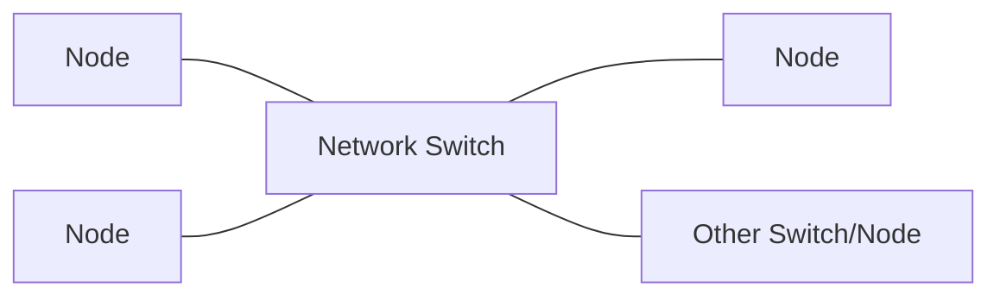

# ST Lab

A [SMPTE](https://www.smpte.org/) ST 2110 engineering design and (future) simulation platform.

## What It Is (And What It Is Becoming)

ST Lab is a web application for planning and designing ST 2110 workflows. It supports network systems engineering by helping teams model signal paths, validate bandwidth, and document design intent before deployment.

## Additional Context

This project is being developed with AI-assisted workflows, and supporting project files are intentionally being kept to document process and progress.

The goal is to build a platform for studying and engineering ST 2110 systems from an engineering perspective. Because IP networking concentrates audio, video, and control traffic on one transport medium, tracking and tracing can become difficult. ST Lab addresses this by providing a visual representation of a network environment while tracking essences, bandwidth, and equipment requirements, including NMOS and PTP design considerations.

ST Lab is a GUI application hosted in Docker and accessed through a web browser. The interaction model is intentionally similar to [Node-RED](https://nodered.org/), using nodes and links to represent systems clearly.

The initial phase focuses on system diagrams that track signals and bandwidth. A later phase introduces simulation. NMOS control features are planned as the platform evolves.

## Project Overview

ST Lab is a planning-focused SMPTE ST 2110 engineering tool for building and validating system designs before deployment. It is intended primarily for engineers who need clear, data-backed reports that can be included with system schematics and design packages.

Phase 1 focuses on system design, bandwidth and essence tracing, and early PTP modeling calculations. Simulation is a planned future feature and is already being considered in architecture decisions so later workflows can be added cleanly.

## Design Principles

- Engineering-first workflow for ST 2110 system planning
- SMPTE-oriented terminology (essence-focused language)
- Reports as a first-class output for design documentation
- Support for simple and complex network structures from day one
- Keep the visual model simple while preserving detailed engineering data

## Core Diagram Model

The visual model is intentionally simplified:

- Each node has one visible connection point by default
- A switch can connect to nodes on either side and to other switches/nodes
- Each visible link is directly selectable
- Each link carries detailed metadata and calculations (not just line art)

One visible link may represent multiple real physical/logical paths in the underlying model. This keeps diagrams readable while still tracking physical switch constraints such as device count, essence count, flow count, and bandwidth usage.

## Network Structure Support

ST Lab is expected to handle multiple design patterns and should support common network structures, including segmented/discrete network planes where needed:

- Media essences
- PTP timing
- NMOS/control
- Management/monitoring

This architecture also keeps room for possible future support of other IP media ecosystems (for example NDI or Dante) without breaking the ST 2110-first model.

## What ST Lab Is Not (Current Scope)

- Not a replacement for production network monitoring/NMS tools
- Not a live controller/orchestrator in the first phase
- Not a full real-time simulator yet (simulation is planned for a later phase)
- Not limited to a single topology style or only simple diagrams

## Early Priority: PTP Engineering

PTP is a core reason this project exists. Early versions should include meaningful PTP-aware design calculations so engineers can evaluate timing architecture choices during planning, not after implementation.

## Example Use Case

An engineer designs a new facility signal network in ST Lab, maps essences across sources, destinations, and switches, then validates per-link and per-switch bandwidth budgets with PTP considerations. The output report is included with the system schematic package for design review and implementation handoff.

## Resources

### Nodes

- Single Source
- Group Source
- Single Destination
- Group Destination
- Dedicated Switch
- Shared Switch
- Grandmaster Clock
- NMOS Device

#### Single Source

A single ST 2110 essence. Can be selectable as an audio, video, or combination source.

**Datapoints:**

- Name
- ID
- Device Type
- Signal type
- Bandwidth (defined or calculated)
- Resolution
- Video Refresh Rate
- Video Bit Depth
- Audio Bit Depth
- Connection Type (Fibre/Copper, 10G/100G)
- IP (op)
- MAC (op)

#### Group Source

A grouped ST 2110 source bundle, intended to represent multiple related essences emitted together (for example multi-channel audio or multi-flow video groups).

**Datapoints:**

- Name
- ID
- Device Type
- Signal type
- Number of Essences/Flows
- Aggregate Bandwidth (defined or calculated)
- Member Flow Definitions
- Connection Type (Fibre/Copper, 10G/100G)
- IP Range / Multicast Group (op)
- MAC (op)

#### Single Destination

A single ST 2110 destination endpoint that receives one essence or a selected source flow.

**Datapoints:**

- Name
- ID
- Device Type
- Accepted Signal type
- Required Bandwidth
- Resolution Support
- Video Refresh Rate Support
- Video Bit Depth Support
- Audio Bit Depth Support
- Connection Type (Fibre/Copper, 10G/100G)
- IP (op)
- MAC (op)

#### Group Destination

A grouped destination endpoint representing multiple receivers or a multi-flow sink that consumes related essences together.

**Datapoints:**

- Name
- ID
- Device Type
- Accepted Signal type
- Number of Destination Flows
- Aggregate Required Bandwidth
- Flow Mapping Rules
- Connection Type (Fibre/Copper, 10G/100G)
- IP Range / Multicast Group (op)
- MAC (op)

#### Dedicated Switch

A network switch node allocated to a specific workflow or signal domain with reserved switching capacity.

**Datapoints:**

- Name
- ID
- Switch Role (Dedicated)
- Port Count
- Port Speeds
- Number of Connected Devices
- Number of Flows/Essences
- Backplane Capacity
- Reserved Bandwidth Budget
- PTP Boundary/Transparent Clock Mode
- Multicast Support
- Management IP (op)

#### Shared Switch

A network switch node shared across multiple workflows, carrying mixed traffic classes and requiring contention-aware capacity planning.

**Datapoints:**

- Name
- ID
- Switch Role (Shared)
- Port Count
- Port Speeds
- Number of Connected Devices
- Number of Flows/Essences
- Backplane Capacity
- Available Bandwidth Budget
- Existing Non-ST2110 Load
- QoS/Priority Profile
- PTP Boundary/Transparent Clock Mode
- Multicast Support
- Management IP (op)

#### Grandmaster Clock

The master PTP timing source for the ST 2110 environment, providing reference time for all synchronized nodes.

**Datapoints:**

- Name
- ID
- Clock Class
- Accuracy
- Priority 1
- Priority 2
- Domain Number
- Announce Interval
- Sync Interval
- Delay Mechanism
- Redundancy Role (Primary/Secondary)
- Management IP (op)

#### NMOS Device

An NMOS-capable control-plane node for registration, discovery, connection management, and orchestration support.

**Datapoints:**

- Name
- ID
- Device Role
- Supported NMOS Specs (IS-04/IS-05/etc)
- API Endpoint
- Node/Device Identifier
- Registration Mode
- Authorization Mode
- Associated Media Flows
- Management IP (op)

### Bandwidth Tracing Data

To support tracing bandwidth through the system at any given point, each node/link model should support time-aware traffic datapoints.

**Datapoints:**

- Timestamp / Snapshot Time
- Measured Bandwidth (Current)
- Peak Bandwidth (Windowed)
- Reserved Bandwidth
- Available Bandwidth
- Ingress Bandwidth
- Egress Bandwidth
- Total Flow Count
- Active Flow Count
- Essence Type Breakdown (Audio/Video/ANC/Control)
- Path / Hop Context (Upstream Node, Current Node, Downstream Node)
- Utilization Percentage (Port and Node level)
- Used Bandwidth

### Links

Links are selectable objects in the design canvas and must expose their own state, calculations, and protocol/network context independently of connected nodes.

#### Link Behavior

- Directly selectable in UI
- Displays source and destination endpoints
- Supports multiple essences/flows per link
- Calculates and displays link utilization in real time or by snapshot
- Highlights protocol/context paths (ST2110 media, NMOS control, PTP timing, management)

#### Link Datapoints

- Link Name
- Link ID
- Link Type (Physical/Logical)
- Source Node
- Source Interface/Port
- Destination Node
- Destination Interface/Port
- Network Plane (Media / PTP / NMOS / Management)
- VLAN / Subnet / VRF (op)
- Link Capacity
- Used Bandwidth
- Available Bandwidth
- Utilization Percentage
- Number of Flows
- Number of Essences
- Essence/Flow Type Breakdown (Audio/Video/ANC/Control)
- NMOS Presence on Link (Yes/No + endpoint reference)
- PTP Presence on Link (Yes/No + role reference)
- Latency (Estimated/Measured)
- Packet Loss / Error State (simulation or measured)
- Link Status (Up/Down/Degraded)

#### Complex Network Layout Support

The link model must support discrete and parallel network topologies, including separate fabrics for:

- Audio/Video Media
- PTP Timing
- NMOS / Control APIs
- Management / Monitoring

Each link should belong to one or more network planes so tracing can follow the correct path through complex systems without mixing unrelated traffic domains.
